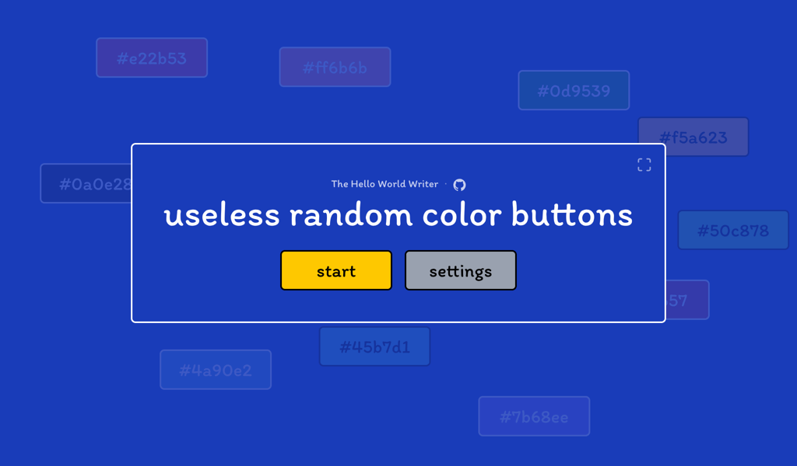
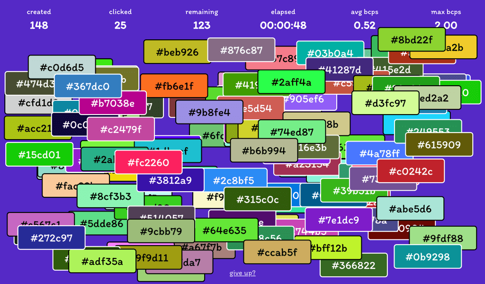

[](https://github.com/TheHelloWorldWriter/useless-random-color-buttons/releases)
[](LICENSE)
[](https://github.com/TheHelloWorldWriter/useless-random-color-buttons)
[](#Contributions)


# useless random color buttons

**useless random color buttons** is a cross-platform web app designed purely as a time waster. The concept is simple: colored buttons spawn randomly and pile up on the screen, creating a rising tide of **controlled visual chaos**. Your goal is to fight the mess, tracking your performance data to gamify the otherwise useless action, or simply acknowledge the futility of the task and give up.

Beyond the simple gameplay, the app functions as **digital bubble wrap**. The glitchy aesthetic - where buttons form a distinct, clickable heap - creates an instant gratification loop every time you clear a section. It serves as a repetitive fidget task that occupies the "fast" part of your brain (reflexes), allowing the "slow" part to take a break. Whether you want to zone out for two minutes or stress-test your browser with thousands of elements, the experience is highly configurable.

Originally built for Netlify's [Dusty Domains](https://dusty.domains/) charity event, the project is engineered with vanilla JavaScript and Tailwind CSS. This lightweight architecture ensures the app works across all modern browsers and allows it to be distributed as a single, portable HTML file that runs offline on any operating system.

## Screenshots

<p align="center">
  
  
</p>

## How to Play

-   **Click:** Tap or click buttons to remove them.

-   **Survive:** They spawn automatically. Don't let them cover the whole screen (or do, it's up to you).

-   **Track:** Watch your stats in the "Game View" - buttons created, average clicks per second (BCPS), and elapsed time.

-   **Customize:** Open settings to change spawn rates, button labels (hex codes, numbers, timestamps), or start with 1,000 buttons if you want to stress-test your browser.

## Two Ways to Run It

The project is accessible in two distinct ways: as a modern web app and as a standalone offline file.

### 1. Online (PWA)

You can play the latest version directly in your browser at: [**https://urcbuttons.thehww.app**](https://urcbuttons.thehww.app)

Since it is a Progressive Web App (PWA), it can be installed on a phone or desktop to run like a native app. Look for the "Install" icon in your browser's address bar or share menu.

### 2. Offline (Portable Edition)

For local use, a packaged offline version is available. It's distributed as a small ZIP archive that you can download from GitHub Releases.

<a href="https://github.com/TheHelloWorldWriter/useless-random-color-buttons/releases/latest/">
  
</a>
<br><br>

**How to run it:**

1.  Unzip the archive.

2.  Locate `urcbuttons.html`.

3.  Double-click it.

It will open immediately in your default web browser. No internet connection is required.

### Wait, where is the executable file?

You might be looking for an executable file (Windows .exe, macOS .app). You won't find one. That is by design.

While web apps are usually run online, this version is distributed as a standard HTML file because it offers universal compatibility. By keeping it as pure web code, the entire app remains under 100KB. Converting this to a native desktop app (using tools like Electron) would increase the file size to hundreds of megabytes. This approach ensures the app is simple, lightweight, and works on Windows, macOS, Linux, Android, and iOS without installation.

## Building from Source

If you want to tinker with the code, here is how to build it yourself.

**Prerequisites:**

-   Node.js installed.

**Setup:**

```bash
git clone https://github.com/TheHelloWorldWriter/useless-random-color-buttons.git
cd useless-random-color-buttons
npm install
```

**Development:** To start the development server with hot reloading:

```bash
npm run dev
```

**Build:** To create the production build (outputs to `dist/`):

```bash
npm run build
```

To create the portable single-file version (outputs to `/dist-packaged/portable/release`):

```bash
npm run build:portable
```

## License

useless random color buttons is licensed under the [MIT License](LICENSE).

---

Made with ❤️ in Oradea, Romania  
https://www.thehelloworldwriter.com
